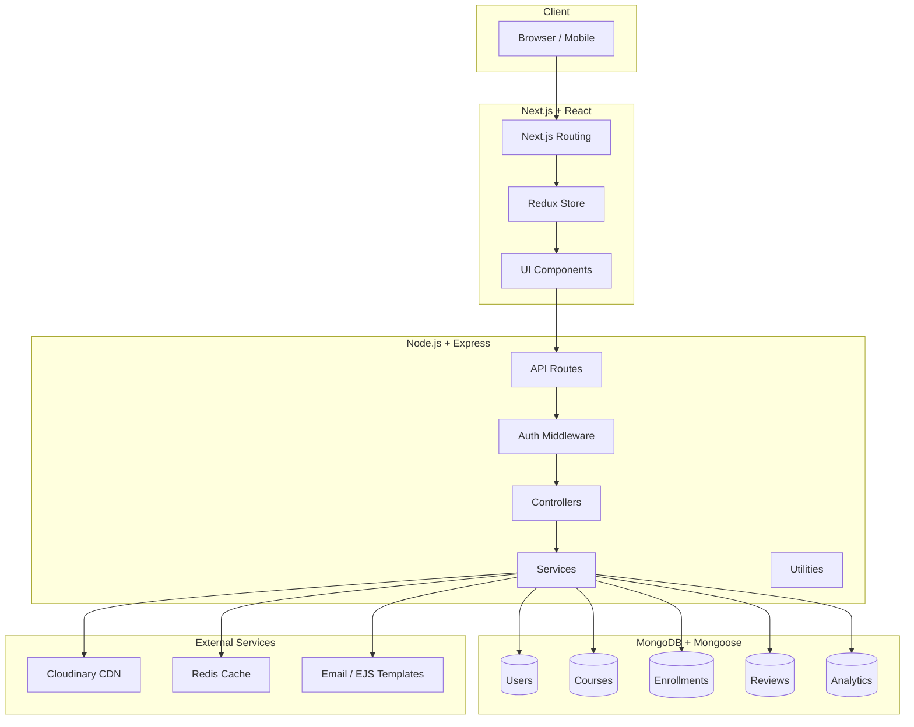
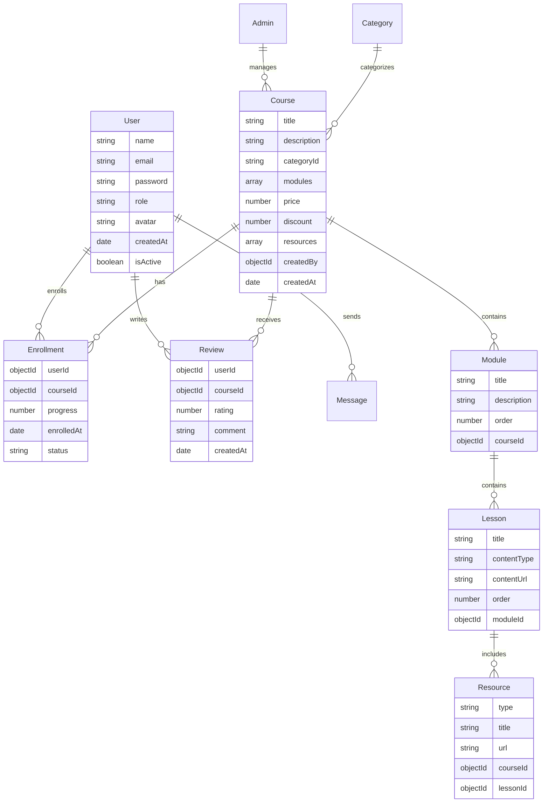
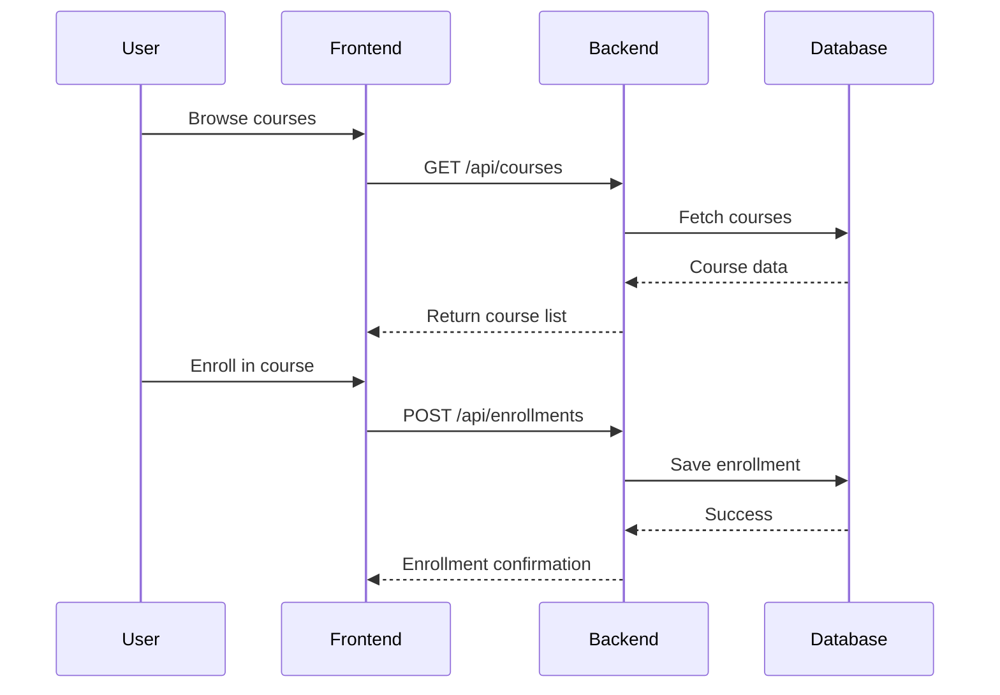
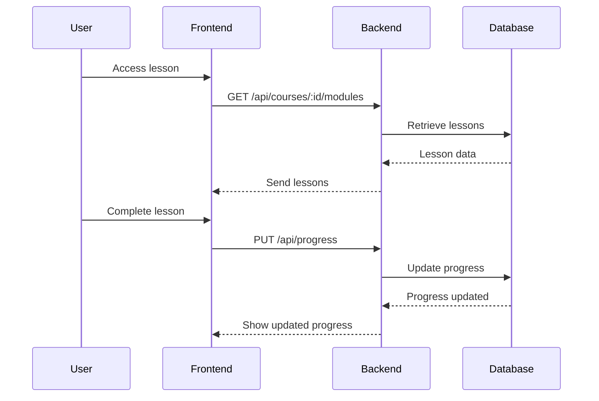

# Learning Management System (LMS)

## Project Overview

* **Name:** Edura
* **One-liner:** A full-featured LMS platform enabling users to enroll in courses, track progress, leave reviews, and manage content efficiently.
* **Repo:** [GitHub Repository](https://github.com/CodesBy-Asif/LMS)
* **Demo:** [Live Demo](https://edura-lms.vercel.app/)

**Goals:**

* Allow users to browse, enroll, and complete courses.
* Enable admins to manage courses, users, and analytics.
* Provide real-time progress tracking and course content delivery.

## Tech Stack
| Layer            | Technology                     | Reason / Benefit                                                    |
| ---------------- | ------------------------------ | ------------------------------------------------------------------- |
| Frontend         | Next.js + React + TypeScript   | SSR/SSG for SEO, modular UI, type safety                            |
| State Management | Redux                          | Centralized state for courses, users, and progress                  |
| Styling          | CSS / Tailwind                 | Rapid styling, consistency, responsive design                       |
| Backend          | Node.js + Express + TypeScript | Fast, non-blocking, modular REST API, type safety                   |
| Database         | MongoDB + Mongoose             | Flexible schema for courses, users, enrollments                     |
| Authentication   | JWT / NextAuth                 | Secure token-based auth, OAuth support                              |
| Storage          | Cloudinary                     | Optimized media storage and CDN delivery                            |
| Email            | NodeMailer / EJS Templates     | Dynamic email notifications and confirmations                       |
| Caching          | Redis                          | Fast access to session data, analytics, and frequently queried info |

## System Architecture

## Database ER Diagram

## User Flows

### Enrollment Flow

### Progress Tracking Flow

## Key Features

### User

* Course browsing, search, and filtering
* Enrollment and progress tracking
* Reviews and ratings
* Messaging with admins

### Admin

* Manage courses, modules, and lessons
* Track enrollments and progress analytics
* Manage categories, FAQ, and hero sections
* Generate reports and monitor system usage

### Core Features

* Responsive design
* JWT / NextAuth authentication
* Cloud-based media storage (Cloudinary)
* Email notifications (NodeMailer + EJS templates)
* Caching with Redis for faster response

